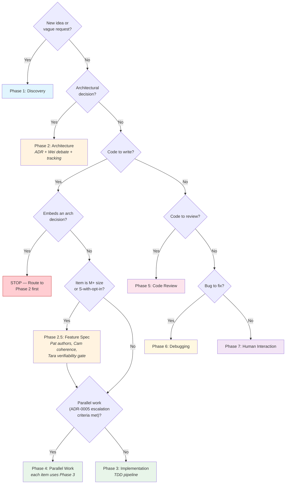

# Hybrid Team Methodology

## TL;DR

Summon organizes AI-assisted development into **8 phases** (numbered 1–7 plus Phase 2.5), each with a different team structure. You don't need to memorize this — the coordinator picks the right team automatically.

| Phase | When | Lead | Model |
|-------|------|------|-------|
| 1. Discovery | New idea or vague request | Cam | Blackboard (open brainstorm) |
| 2. Architecture | Design decisions, tech choices | Archie | Ensemble + Wei debate |
| 2.5. Feature Spec | M+ item before TDD red phase | Pat → Cam → (Archie) → Tara | Pipeline (author → review → gate) |
| 3. Implementation | Writing code | Tara → Sato | TDD pipeline (red-green-refactor) |
| 4. Parallel Work | 3+ independent items meeting ADR-0005 escalation criteria | Grace | Single-threaded by default; owned partition by exception |
| 5. Code Review | Reviewing changes | Vik + Tara + Pierrot | Three parallel lenses |
| 6. Debugging | Fixing bugs | Sato | Blackboard (shared investigation) |
| 7. Human Interaction | Consulting the user | Cam | Single point of contact |

**Next:** See [personas.md](personas.md) for the full agent roster. See [../process/team-governance.md](../process/team-governance.md) for triggers, debate protocol, and governance rules.

---

Different development phases need different organizational structures. Instead of a fixed hierarchy, the coordinator selects the appropriate team composition at each phase transition. This document defines the 7 phases, their org models, and which agents participate.

## Core Insight

No single org structure works for everything:
- **Discovery** needs a shared workspace where anyone can contribute ideas (blackboard)
- **Implementation** needs a strict pipeline with clear handoffs (TDD pipeline)
- **Code review** needs multiple independent reviewers working in parallel (ensemble)
- **Debugging** needs open collaboration on a shared problem space (blackboard)

The coordinator's job is to recognize phase transitions and assemble the right team.

## The 7 Phases

### Phase 1: Discovery

**Org Model:** Blackboard (shared workspace, anyone contributes)

| Role | Agent | Responsibility |
|------|-------|---------------|
| Lead | **Cam** | Elicitation, probing, clarifying |
| Contribute | **Pat** | Business value, priorities |
| Contribute | **Dani** | Sacrificial concepts, user needs |
| Contribute | **Wei** | Challenge assumptions |
| Optional | **Debra** | Data/ML feasibility |

**How it works:** Cam leads elicitation. All contributing agents can add ideas to the "blackboard" (plan document). No hierarchy — the best idea wins regardless of source. Cam synthesizes and confirms with the human.

**Transition to next phase:** When the human confirms the vision is clear and the direction is chosen.

---

### Phase 2: Architecture

**Org Model:** Ensemble + Adversarial Debate

| Role | Agent | Responsibility |
|------|-------|---------------|
| Lead | **Archie** | System design, ADR authorship |
| Challenger | **Wei** | Devil's advocate on every decision |
| Reviewer | **Vik** | Simplicity check on proposed architecture |
| Constraint | **Pierrot** | Security surface assessment |
| Constraint | **Ines** | Operational feasibility |
| Optional | **Cloud Architect** | Cloud-specific design (if targeting cloud) |

**How it works:** Archie proposes architecture. Wei challenges it (adversarial debate protocol). Vik checks for over-engineering. Pierrot flags security concerns. Ines validates operational feasibility. Debates are multi-round — see the Adversarial Debate Protocol in `docs/process/team-governance.md`.

**Mandatory steps before transition:**
1. Archie writes or updates an ADR in `docs/adrs/`.
2. Wei is invoked as a **standalone agent** to challenge the ADR. This is NOT optional — skipping Wei is a process violation.
3. The multi-round debate (minimum 2 rounds) is executed and tracked in `docs/tracking/YYYY-MM-DD-<topic>-debate.md`.
4. The ADR is updated to reflect debate outcomes.

**Transition to next phase:** When ALL of the following are true:
- The ADR exists and is marked Accepted.
- Wei has challenged it and the debate is tracked.
- The human approves the architecture.

**If this phase is skipped:** The coordinator must check at Implementation entry: "Is there an architectural decision embedded in this work item?" If yes, **stop** — return to Phase 2 before proceeding. An architectural decision made during implementation without Wei's challenge is a process failure that will be flagged in the sprint retro.

---

### Phase 2.5: Feature Spec

**Org Model:** Pipeline (author → coherence-review → verifiability gate)

| Stage | Agent | Responsibility |
|------|-------|---------------|
| Author | **Pat** (or human / coordinator in proxy mode) | Drafts the six-section spec at `docs/specs/<work-item-id>-<slug>.md` |
| Coherence review | **Cam** | Pressure-tests spec-vs-AC drift between authoring and Tara's gate |
| Architecture review (conditional) | **Archie** | Reviews any Key Decision touching cross-component interfaces, persistence, security, or external dependencies — escalates to a new ADR if the decision is architectural |
| Verifiability gate | **Tara** | Confirms the Verification Plan is sufficient before red phase begins |

**How it works:** For items requiring a spec (M+ by default; S by opt-in with audit trail; XS forbidden), Pat authors the six-section spec per [ADR-0004 § 1](../adrs/0004-feature-spec-artifact.md#1-schema): Outcomes, Scope, Constraints, Key Decisions, Task Breakdown, Verification Plan. Cam pressure-tests for spec-vs-AC drift. Archie reviews when objective triggers fire (cross-component, persistence, security, external deps). Tara confirms the Verification Plan supports the red phase. The spec becomes canonical when the human (or Pat in proxy mode for non-architectural items) confirms it.

**Citation requirements (mechanical):** Each Scope bullet MUST cite the AC it bounds. Each Key Decision MUST cite the governing ADR or declare "no ADR applies because <one-sentence rationale>". A spec failing either check is non-conformant; Tara returns it before red phase.

**Size carve-out** (per [ADR-0004 § 4](../adrs/0004-feature-spec-artifact.md#4-size-carve-out)):

| Size | Spec status |
|---|---|
| XS | Forbidden — commit + tests are the contract |
| S | Optional, default off; opt-in requires one-line rationale + Pat + Tara sign-off |
| M | Required |
| L | Required |
| XL | Required + decomposition review (Pat + Archie + Grace) |

**Tara hard-backstop:** Tara MUST refuse to author tests for any M+ item that has no spec link. This rule is active independent of the Done Gate amendment and survives any pre-W1.1-landing window.

**Architectural escalation:** If Archie deems any Key Decision architectural rather than item-local, the spec stalls and a new ADR is opened. The work item halts until that ADR is Accepted. There is no "Archie noted this and we proceeded" path.

**Template:** [`docs/scaffolds/feature-spec.md`](../scaffolds/feature-spec.md). Slash command stub: `/feature-spec`.

**Transition to next phase:** When the spec is canonical, citations verify, and Tara has accepted the Verification Plan.

---

### Phase 3: Implementation (TDD Pipeline)

**Org Model:** Pipeline (strict sequential handoffs)

| Stage | Agent | Responsibility |
|-------|-------|---------------|
| Red | **Tara** | Write failing tests |
| Green | **Sato** | Make tests pass with minimum code |
| Refactor | **Sato** | Clean up while keeping tests green |
| Verify | **Tara** | Confirm tests pass, coverage adequate |

**How it works:** Strict TDD pipeline. Tara writes failing tests first. Sato implements. Sato refactors. Tara verifies. No skipping steps. For items sized M or larger, Tara must be invoked as a standalone agent (not inlined by Sato).

**Transition to next phase:** When implementation is complete and tests pass.

---

### Phase 4: Parallel Work

**Org Model:** Owned partition (Grace-authored ownership map; single-thread default)

| Role | Agent | Responsibility |
|------|-------|---------------|
| Map author | **Grace** | Sole authoring path for ownership-map entries (creation, transfer, dissolution) |
| Workers | **Sato** (x N) | Parallel implementation streams, one writer-role-at-a-time per partition |
| Workers | **Tara** (x N) | Parallel test writing within the TDD-pipeline carve-out |
| Workers | **Dani** | UI/UX work (parallel to backend) |
| Workers | **Ines** | Infrastructure work (parallel to app code) |
| Workers | **Diego** | Documentation (parallel to implementation) |

**Owned partition (definition).** A **partition** is a *named, time-bounded scope of write authority over a defined set of files or interfaces, owned by exactly one writer-role-at-a-time for the partition's lifetime* (per [ADR-0007 § 1](../adrs/0007-owned-partition.md#1-what-a-partition-is)). A partition exists if and only if it has an entry in the active ownership map. **The absence of an ownership-map entry is the steady state**; a partition is the artifact of an explicit decision to parallelize.

**Single-thread default.** Code-write work runs single-threaded by default per [ADR-0005](../adrs/0005-single-threaded-default.md). Owned partitions are the **legitimate path to parallelism** when [ADR-0005 § 4](../adrs/0005-single-threaded-default.md#4-escalation-criteria-from-single-thread-to-parallel)'s three escalation criteria are jointly satisfied: (1) measured single-thread ceiling, (2) clean ownership per [ADR-0007](../adrs/0007-owned-partition.md) (Grace has authored a conforming entry), (3) ≤5 concurrent streams. Read-side parallelism (multi-lens code review, parallel architecture debate, parallel specialist consultation) is **unaffected** and remains the model for those activities.

**Ownership map artifact.** The template lives at [`docs/scaffolds/ownership-map.md`](../scaffolds/ownership-map.md). Live maps for an active sprint live at `docs/sprints/<sprint-id>-ownership-map.md` (e.g., `docs/sprints/sprint-1-ownership-map.md`); Grace copies from the template and fills in entries per the nine-field schema in [ADR-0007 § 2](../adrs/0007-owned-partition.md#2-ownership-map-schema). The map accumulates dissolved entries within a sprint and is retired by Grace at sprint boundary alongside the progress note.

**Grace is the only authoring path.** Per [ADR-0007 § 5](../adrs/0007-owned-partition.md#5-plan-as-bypass-mitigation), no agent other than Grace adds entries to the ownership map. A plan, sprint document, or human prompt that lists multiple parallel items is *input* to Grace's authoring decision — Grace MAY collapse, decompose, or reject the parallelism. The plan's structure does not bind Grace's decision. See the [Plan-Encoded Partition anti-pattern](../process/gotchas.md#process) for the cross-reference.

**Concurrency cap: ≤5 partitions.** Inherited from [ADR-0005 § 4](../adrs/0005-single-threaded-default.md#4-escalation-criteria-from-single-thread-to-parallel) criterion 3 and confirmed in [ADR-0007 § 6](../adrs/0007-owned-partition.md#6-concurrency-cap). Five is the hard cap, not a target. Most waves have zero or one open partitions. Grace counts open entries (those with no `dissolution-event` annotation) before authoring a new entry and rejects the sixth.

**Lifecycle (summary; full spec in [ADR-0007 § 3](../adrs/0007-owned-partition.md#3-lifecycle-creation-transfer-dissolution)).**

- **Creation** (4-step gate): (1) ADR-0005's three escalation criteria jointly satisfied; (2) Grace authors the entry; (3) human (or Pat in proxy mode for non-architectural items) approves; (4) the writer launches only after steps 1–3 are recorded in-repo.
- **Transfer:** ownership moves between agents via a `superseded-by` exit-condition. The original entry closes with `superseded-by: P<new>`, a new entry opens with the new owner, and the new entry's `entry-condition` cites the prior partition ID. Mid-flight transfer is a Grace-authored act.
- **TDD-pipeline carve-out (NOT a transfer).** Sequential agent occupancy of one partition through the [ADR-0002](../adrs/0002-tdd-workflow.md) TDD pipeline (Tara red → Sato green → Sato refactor → Tara verify) is the canonical pipeline execution for a single owner-role and does **not** require `superseded-by` ceremony. The `owner` field names the role-at-a-time, not the specific agent invocation.
- **Dissolution:** the writer's commits land on the integration branch with no conflicts and the work item's tests pass. Grace records `dissolution-event:<commit>` on the entry.
- **`time-bound` exceedance fires a Blocker.** If a partition's `time-bound` is exceeded without `merge-clean` or `superseded-by` firing, Grace creates a Blocker per [ADR-0006 § 1](../adrs/0006-harness-contract.md#1-progress-note-schema): `B<n>: partition P<id> exceeds time-bound; awaiting-human or Pat-in-proxy authorization to extend or dissolve.` The Blocker gates further writer-launch on the affected partition via `/handoff` `gates:`.

**Renegotiation on cross-partition collision (summary; full spec in [ADR-0007 § 4](../adrs/0007-owned-partition.md#4-late-arriving-cross-partition-work)).** When work surfaces mid-flight that touches the scope of an open partition not its own, Grace applies the partition-renegotiation decision tree. For cross-partition collisions (work touches two or more open partitions' scope), the rule is **halt and renegotiate**: Grace stops both writers, records a Blocker in the progress note, and re-authors the partition map. The human (or Pat in proxy mode) approves the new layout before any writer resumes. **Tiebreaker:** the partition with the **earlier `partition-id`** (lower numerical sequence within the same wave) keeps its scope; the later one is reshaped or dissolved. There is no "we'll figure it out at merge" path.

**Plan-as-Bypass and Plan-Encoded Partition cross-references.** A plan is *input* to the Phase 4 decision, not a bypass of it. See [`gotchas.md` § Process — Plan-as-Bypass anti-pattern](../process/gotchas.md#process) (line 67 sibling) and the [Plan-Encoded Partition anti-pattern](../process/gotchas.md#process) for the detection signals and fixes. The two anti-patterns are siblings, not duplicates: Plan-as-Bypass skips the ADR/TDD/review process; Plan-Encoded Partition skips the Grace-authoring gate specifically.

**Honor-system disclosure (per [ADR-0007 § 5](../adrs/0007-owned-partition.md#5-plan-as-bypass-mitigation)).** Grace's refusal-on-malformed-entry is *mechanical at map-authoring time* — it catches missing fields, overlap, and cap exceedance at the moment Grace is asked to author. **What is not mechanical is the act of *invoking Grace* in the first place.** Writer-launch enforcement is post-hoc Vik review under the four-lens code review (identical pattern to [ADR-0005 § 4](../adrs/0005-single-threaded-default.md#4-escalation-criteria-from-single-thread-to-parallel)). A future `create-summon` CLI gate (Sprint-N+ work) is the natural home for a real-time writer-launch refusal that fires when no ownership-map entry exists for the launched scope; that tooling is explicitly out of scope for this ADR. Until then, the three layered enforcements (Grace-only authoring path, four-lens detection signal, plan-input rule) are the achievable defense.

**Transition to next phase:** When all open partitions reach `merge-clean` exit-conditions (or are dissolved by `superseded-by` transfer), and no Blocker remains on the active map.

---

### Phase 5: Code Review

**Org Model:** Ensemble (3 parallel reviewers)

| Role | Agent | Responsibility |
|------|-------|---------------|
| Coordinator | Orchestrator | Launches reviewers, synthesizes |
| Reviewer | **Vik** | Simplicity, maintainability |
| Reviewer | **Tara** | Test quality, coverage |
| Reviewer | **Pierrot** | Security surface |
| Optional | **Dani** | UI/UX review (if frontend changes) |

**How it works:** All three reviewers run in parallel (same message, multiple Task calls). Each provides independent findings. The coordinator synthesizes findings by severity. If a reviewer flags a blocking concern, it triggers adversarial debate with the implementer (Sato).

**Transition to next phase:** When all critical and important findings are addressed.

---

### Phase 6: Debugging

**Org Model:** Blackboard (shared problem space)

| Role | Agent | Responsibility |
|------|-------|---------------|
| Lead | **Sato** | Hypothesis generation, fix implementation |
| Contribute | **Tara** | Reproduce via failing test |
| Contribute | **Vik** | Pattern recognition, root cause intuition |
| Contribute | **Pierrot** | Security-related root causes |
| Optional | **Ines** | Infrastructure-related root causes |
| Optional | **Debra** | Data/ML-related root causes |

**How it works:** Shared "blackboard" — a debugging document where agents post hypotheses, observations, and evidence. Tara writes a failing test that reproduces the bug. Sato investigates and fixes. Vik contributes pattern-based intuition. Any agent can contribute if they spot something.

**Backlog scan:** Before designing new diagnostic tooling, Tara and Sato check the backlog for features that could help diagnose or reproduce the bug. A planned "preview" feature, "debug panel," "export" capability, or "logging enhancement" may already solve the diagnostic need. If found, flag it to Pat for dual-duty pull-forward consideration.

**Transition to next phase:** When the bug is fixed and the regression test passes.

---

### Phase 7: Human Interaction

**Org Model:** Hierarchical (single point of contact)

| Role | Agent | Responsibility |
|------|-------|---------------|
| Lead | **Cam** | All human-facing communication |
| Support | **Pat** | Business context for decisions |
| Support | **Grace** | Status updates, progress reports |

**How it works:** Cam is the single point of contact for the human. Other agents feed information to Cam, who synthesizes and presents it. This prevents the human from being overwhelmed by multiple agent voices. Cam translates between agent-speak and human-speak.

**When to use:** Any time the human needs to be consulted, informed, or asked for a decision. Cam is the default for all human interaction unless the human explicitly asks to speak to a specific agent.

**Proxy mode:** When the human declares unavailability (e.g., "I'm going to bed"), Pat becomes Lead for product questions. The coordinator routes questions that would normally go to the human through Pat instead. Pat uses `docs/product-context.md` to answer within the human's known preferences, applying conservative defaults for uncovered areas. Pat cannot approve ADRs, change scope, make architectural choices, or override vetoes — those block until the human returns. All proxy decisions are recorded in the cross-session progress note's **Blockers** section per [ADR-0006](../adrs/0006-harness-contract.md) (canonical artifact at `.claude/progress-note.md`; written by `/handoff`). Proxy mode ends when the human sends any message.

**Cross-session continuity (harness contract).** [ADR-0006](../adrs/0006-harness-contract.md) defines the canonical cross-session artifact: a structured progress note at `.claude/progress-note.md` with a fixed header (`session-date`, `author`, `prior-note-commit`) and five named sections (State, Next Step, Learnings, Open Questions, Blockers). The `/handoff` command writes it; the schema is binding and the command refuses to write a non-conforming note. The `/resume` command reads it in the order **State → Blockers → Open Questions → Next Step → Learnings**. The legacy `.claude/handoff.md` is a single-line redirect after W1.3 close.

**Harness role mapping (planner / generator / evaluator overlay).** Per [ADR-0006 § 2 Persona-Role Mapping](../adrs/0006-harness-contract.md#2-persona-role-mapping), Summon adopts the *functional* separation of plan / generate / evaluate but rejects a one-to-one persona triad. The mapping:

| Harness role | Summon binding |
|---|---|
| **Plan** | The feature-spec artifact (per [ADR-0004](../adrs/0004-feature-spec-artifact.md)). Plan-quality is jointly owned: Pat decomposes (authorship), Cam coherence-checks, Archie architecture-gates, Tara verifies. |
| **Generate** | **Sato.** |
| **Evaluate** | **Tara**, applying the Verifiability gate from ADR-0004. |

This mapping is documented in three places: this phase doc, [ADR-0006](../adrs/0006-harness-contract.md), and a per-persona `**Harness role:**` annotation in [`personas.md`](./personas.md) (Cam / Pat / Archie / Sato / Tara). The `.claude/agents/` agent files are NOT edited. For below-spec items (XS, S without opt-in), the in-flight progress note's Next Step stands in for the spec.

---

## Phase Selection Flowchart

## Phase Nesting

Phases can nest. Common patterns:

- **Parallel Work** contains multiple **Implementation** pipelines running concurrently
- **Discovery** may trigger **Architecture** for technical feasibility checks
- **Code Review** may trigger **Debugging** if a reviewer finds a bug
- **Any phase** can trigger **Human Interaction** when a decision is needed

The coordinator manages the phase stack — knowing which phase is active and which phases are suspended waiting for a sub-phase to complete.

## Agent Participation Summary

| Agent | Discovery | Architecture | Implementation | Parallel | Review | Debugging | Human |
|-------|:---------:|:------------:|:--------------:|:--------:|:------:|:---------:|:-----:|
| **Cam** | Lead | | | | | | Lead |
| **Sato** | | | Green+Refactor | Worker | | Lead | |
| **Tara** | | | Red+Verify | Worker | Reviewer | Contribute | |
| **Pat** | Contribute+1b | | | | | | Lead/Support* |
| **Grace** | | | | Coordinator | | | Support |
| **Archie** | | Lead | | | | | |
| **Dani** | Contribute | | | Worker | Optional | | |
| **Pierrot** | | Constraint | | | Reviewer | Contribute | |
| **Vik** | | Reviewer | | | Reviewer | Contribute | |
| **Ines** | | Constraint | | Worker | | Optional | |
| **Diego** | | | | Worker | | | |
| **Wei** | Contribute | Challenger | | | | | |
| **Debra** | Optional | | | | | Optional | |
| **Cloud** | | Optional | | | | | |

**Table annotations:**
- **+1b**: Pat leads Discovery Phase 1b (Human Model Elicitation) after Cam's vision elicitation.
- **Lead/Support***: Pat is Lead in proxy mode (human unavailable), Support in normal mode.
