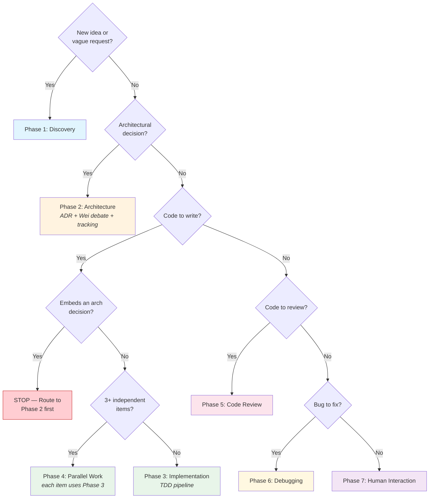

# Hybrid Team Methodology

## TL;DR

Summon organizes AI-assisted development into **7 phases**, each with a different team structure. You don't need to memorize this — the coordinator picks the right team automatically.

| Phase | When | Lead | Model |
|-------|------|------|-------|
| 1. Discovery | New idea or vague request | Cam | Blackboard (open brainstorm) |
| 2. Architecture | Design decisions, tech choices | Archie | Ensemble + Wei debate |
| 3. Implementation | Writing code | Tara → Sato | TDD pipeline (red-green-refactor) |
| 4. Parallel Work | 3+ independent items | Grace | Market (self-claim) |
| 5. Code Review | Reviewing changes | Vik + Tara + Pierrot | Three parallel lenses |
| 6. Debugging | Fixing bugs | Sato | Blackboard (shared investigation) |
| 7. Human Interaction | Consulting the user | Cam | Single point of contact |

**Next:** See [personas.md](personas.md) for the full agent roster. See [../process/team-governance.md](../process/team-governance.md) for triggers, debate protocol, and governance rules.

---

Different development phases need different organizational structures. Instead of a fixed hierarchy, the coordinator selects the appropriate team composition at each phase transition. This document defines the 7 phases, their org models, and which agents participate.

## Core Insight

No single org structure works for everything:
- **Discovery** needs a shared workspace where anyone can contribute ideas (blackboard)
- **Implementation** needs a strict pipeline with clear handoffs (TDD pipeline)
- **Code review** needs multiple independent reviewers working in parallel (ensemble)
- **Debugging** needs open collaboration on a shared problem space (blackboard)

The coordinator's job is to recognize phase transitions and assemble the right team.

## The 7 Phases

### Phase 1: Discovery

**Org Model:** Blackboard (shared workspace, anyone contributes)

| Role | Agent | Responsibility |
|------|-------|---------------|
| Lead | **Cam** | Elicitation, probing, clarifying |
| Contribute | **Pat** | Business value, priorities |
| Contribute | **Dani** | Sacrificial concepts, user needs |
| Contribute | **Wei** | Challenge assumptions |
| Optional | **Debra** | Data/ML feasibility |

**How it works:** Cam leads elicitation. All contributing agents can add ideas to the "blackboard" (plan document). No hierarchy — the best idea wins regardless of source. Cam synthesizes and confirms with the human.

**Transition to next phase:** When the human confirms the vision is clear and the direction is chosen.

---

### Phase 2: Architecture

**Org Model:** Ensemble + Adversarial Debate

| Role | Agent | Responsibility |
|------|-------|---------------|
| Lead | **Archie** | System design, ADR authorship |
| Challenger | **Wei** | Devil's advocate on every decision |
| Reviewer | **Vik** | Simplicity check on proposed architecture |
| Constraint | **Pierrot** | Security surface assessment |
| Constraint | **Ines** | Operational feasibility |
| Optional | **Cloud Architect** | Cloud-specific design (if targeting cloud) |

**How it works:** Archie proposes architecture. Wei challenges it (adversarial debate protocol). Vik checks for over-engineering. Pierrot flags security concerns. Ines validates operational feasibility. Debates are multi-round — see the Adversarial Debate Protocol in `docs/process/team-governance.md`.

**Mandatory steps before transition:**
1. Archie writes or updates an ADR in `docs/adrs/`.
2. Wei is invoked as a **standalone agent** to challenge the ADR. This is NOT optional — skipping Wei is a process violation.
3. The multi-round debate (minimum 2 rounds) is executed and tracked in `docs/tracking/YYYY-MM-DD-<topic>-debate.md`.
4. The ADR is updated to reflect debate outcomes.

**Transition to next phase:** When ALL of the following are true:
- The ADR exists and is marked Accepted.
- Wei has challenged it and the debate is tracked.
- The human approves the architecture.

**If this phase is skipped:** The coordinator must check at Implementation entry: "Is there an architectural decision embedded in this work item?" If yes, **stop** — return to Phase 2 before proceeding. An architectural decision made during implementation without Wei's challenge is a process failure that will be flagged in the sprint retro.

---

### Phase 3: Implementation (TDD Pipeline)

**Org Model:** Pipeline (strict sequential handoffs)

| Stage | Agent | Responsibility |
|-------|-------|---------------|
| Red | **Tara** | Write failing tests |
| Green | **Sato** | Make tests pass with minimum code |
| Refactor | **Sato** | Clean up while keeping tests green |
| Verify | **Tara** | Confirm tests pass, coverage adequate |

**How it works:** Strict TDD pipeline. Tara writes failing tests first. Sato implements. Sato refactors. Tara verifies. No skipping steps. For items sized M or larger, Tara must be invoked as a standalone agent (not inlined by Sato).

**Transition to next phase:** When implementation is complete and tests pass.

---

### Phase 4: Parallel Work

**Org Model:** Market / Self-claim

| Role | Agent | Responsibility |
|------|-------|---------------|
| Coordinator | **Grace** | Work distribution, status tracking |
| Workers | **Sato** (x N) | Parallel implementation streams |
| Workers | **Tara** (x N) | Parallel test writing |
| Workers | **Dani** | UI/UX work (parallel to backend) |
| Workers | **Ines** | Infrastructure work (parallel to app code) |
| Workers | **Diego** | Documentation (parallel to implementation) |

**How it works:** Grace identifies independent work items that can proceed in parallel. Agents self-claim or are assigned non-overlapping work. Multiple Task tool calls launch parallel agent teams. Grace tracks progress and flags blockers.

**When to use:** When there are 3+ independent work items that don't share dependencies. Default to parallel unless there's a true data dependency between items.

**Transition to next phase:** When all parallel work items are complete.

---

### Phase 5: Code Review

**Org Model:** Ensemble (3 parallel reviewers)

| Role | Agent | Responsibility |
|------|-------|---------------|
| Coordinator | Orchestrator | Launches reviewers, synthesizes |
| Reviewer | **Vik** | Simplicity, maintainability |
| Reviewer | **Tara** | Test quality, coverage |
| Reviewer | **Pierrot** | Security surface |
| Optional | **Dani** | UI/UX review (if frontend changes) |

**How it works:** All three reviewers run in parallel (same message, multiple Task calls). Each provides independent findings. The coordinator synthesizes findings by severity. If a reviewer flags a blocking concern, it triggers adversarial debate with the implementer (Sato).

**Transition to next phase:** When all critical and important findings are addressed.

---

### Phase 6: Debugging

**Org Model:** Blackboard (shared problem space)

| Role | Agent | Responsibility |
|------|-------|---------------|
| Lead | **Sato** | Hypothesis generation, fix implementation |
| Gate | **Tara** | Owns the reproducer as pre-work; verifies the entry gate under her coverage veto |
| Contribute | **Vik** | Pattern recognition, root cause intuition |
| Contribute | **Pierrot** | Security-related root causes |
| Optional | **Ines** | Infrastructure-related root causes |
| Optional | **Debra** | Data/ML-related root causes |

**How it works:** Shared "blackboard" — a debugging document where agents post hypotheses, observations, and evidence. Tara's reproducer is **pre-work, not a blackboard activity** — it is the entry gate below, and the blackboard opens once it is met. From there Sato investigates and fixes, Vik contributes pattern-based intuition, and any agent can contribute if they spot something.

**Entry gate — a loop that goes red before any hypothesis.** Forming a theory by reading source, before anything reproduces the fault, is precisely the failure this gate exists to stop.

**Owners:** Tara and Sato jointly, as pre-work before the blackboard opens — Tara builds the reproducer (her Phase 6 role), Sato consumes it. **Verifier:** Tara, under her coverage veto. The lead does not self-certify his own entry gate.

The blackboard opens once the pasted evidence shows **two runs of one command** — red on the bug, green on a control:

- **Red on the bug** _(deterministic — the paste exists or it doesn't)_ — invocation and output, showing the assertion's **actual vs expected**, plus one line: "red because `<observed>` instead of `<expected>`." This excludes red-for-the-wrong-reason: an unrelated pre-existing failure, an import error, or a typo in the harness.
- **Green on a control** _(deterministic)_ — the same command against a known-good input, an adjacent non-buggy case, or the pre-bug revision. Without this, an unconditionally-red loop (`assert false`, a URL that 404s regardless) satisfies every other bullet. A loop never shown to go green is not a loop.
- **Repeatable** _(deterministic)_ — three identical verdicts back to back for a reliable bug, or a stated `k/N` rate for an intermittent one. A single run evidences nothing about repeatability. Intermittent bugs are not held to a clean repro; they are held to a measured, pinned rate high enough to debug against.
- **Fast** _(deterministic)_ — elapsed time visible in the paste (run under `time`, or include the runner's own duration). Seconds, not minutes.
- **Asserts the user's symptom** _(inferential, sometimes human-judgement — this is the bullet to scrutinise)_ — quote the symptom **verbatim from the bug report** beside the assertion, so any drift between what was reported and what is checked is visible to a reader. An agent cannot verify this equivalence about itself; the quote makes it reviewable, not proven.

**Two escape hatches, both carrying an evidence burden.** If no loop can be built, say so explicitly, list what was tried, and ask the human for a reproducing environment, a captured artifact, or permission to instrument. If the loop is built but the symptom mapping is uncertain, escalate the same way — do not proceed on a guess about what the user meant.

**Minimise before hypothesising.** Once red, strip the reproduction down — remove inputs, config, and steps one at a time, re-running after each removal and keeping only what the failure depends on. Stop when nothing further can be removed without the loop going green. A smaller reproduction leaves fewer suspects for the hypothesis stage and is the thing you commit as the regression test.

**Hypotheses are blackboard-wide, not the lead's alone.** Every participant posting to the blackboard generates **3–5 ranked, falsifiable** hypotheses before any is tested, each stating its prediction ("if X is the cause, changing Y makes the bug disappear"). A hypothesis with no stated prediction is a vibe — sharpen or discard it. Produce the whole ranked set before testing any of it — stopping at the first idea that sounds right anchors the entire investigation on it.

**When no correct seam exists for the regression test, that is itself the finding** — but the claim is expensive to make, not free. An agent that passed the entry gate has already built something that drives the bug path and asserts the symptom, so the real question is rarely "does a seam exist" and almost always "is this loop committable as a test?" To invoke the clause you must name the seams considered and why each is too shallow, show the loop you did build and what specifically blocks committing it, and file it as a tracked item on Archie's conformance lens rather than a blackboard line that evaporates. **It never removes the obligation to commit something:** a shallow test plus a documented gap carrying a `summon:` debt marker beats nothing.

_The entry gate and minimisation rule adapt conventions from [mattpocock/skills](https://github.com/mattpocock/skills) (`diagnosing-bugs`), MIT © 2026 Matt Pocock._

**Backlog scan:** Before designing new diagnostic tooling, Tara and Sato check the backlog for features that could help diagnose or reproduce the bug. A planned "preview" feature, "debug panel," "export" capability, or "logging enhancement" may already solve the diagnostic need. If found, flag it to Pat for dual-duty pull-forward consideration.

**Transition to next phase:** all four, verified by Tara:

1. The regression test is **committed to the suite** — not a throwaway script or a `/tmp` harness. A fixed bug with no committed test is unprotected and free to regress.
2. That test is shown **failing on the pre-fix revision** and passing on the fix. This is the entry gate's control run at the other end, and it is what makes the test's red meaningful.
3. The **full suite is green**, per Done Gate item 1 — a fix that repairs the repro while breaking three other behaviours has not transitioned.
4. The entry-gate loop is re-run against the **original, un-minimised** scenario. State explicitly what that scenario does *not* reproduce from the reported environment (data volume, concurrency, the user's config) — re-running the same command through the same assertion cannot detect an oracle that was wrong from the start.

---

### Phase 7: Human Interaction

**Org Model:** Hierarchical (single point of contact)

| Role | Agent | Responsibility |
|------|-------|---------------|
| Lead | **Cam** | All human-facing communication |
| Support | **Pat** | Business context for decisions |
| Support | **Grace** | Status updates, progress reports |

**How it works:** Cam is the single point of contact for the human. Other agents feed information to Cam, who synthesizes and presents it. This prevents the human from being overwhelmed by multiple agent voices. Cam translates between agent-speak and human-speak.

**When to use:** Any time the human needs to be consulted, informed, or asked for a decision. Cam is the default for all human interaction unless the human explicitly asks to speak to a specific agent.

**Proxy mode:** When the human declares unavailability (e.g., "I'm going to bed"), Pat becomes Lead for product questions. The coordinator routes questions that would normally go to the human through Pat instead. Pat uses `docs/product-context.md` to answer within the human's known preferences, applying conservative defaults for uncovered areas. Pat cannot approve ADRs, change scope, make architectural choices, or override vetoes — those block until the human returns. All proxy decisions are logged in `.claude/handoff.md` under `## Proxy Decisions (Review Required)`. Proxy mode ends when the human sends any message.

---

## Phase Selection Flowchart

```mermaid
flowchart TD
    A{"New idea or<br/>vague request?"} -->|Yes| P1["Phase 1: Discovery"]
    A -->|No| B{"Architectural<br/>decision?"}
    B -->|Yes| P2["Phase 2: Architecture<br/><em>ADR + Wei debate + tracking</em>"]
    B -->|No| C{"Code to write?"}
    C -->|Yes| D{"Embeds an arch<br/>decision?"}
    D -->|Yes| STOP["STOP — Route to<br/>Phase 2 first"]
    D -->|No| E{"3+ independent<br/>items?"}
    E -->|Yes| P4["Phase 4: Parallel Work<br/><em>each item uses Phase 3</em>"]
    E -->|No| P3["Phase 3: Implementation<br/><em>TDD pipeline</em>"]
    C -->|No| F{"Code to review?"}
    F -->|Yes| P5["Phase 5: Code Review"]
    F -->|No| G{"Bug to fix?"}
    G -->|Yes| P6["Phase 6: Debugging"]
    G -->|No| P7["Phase 7: Human Interaction"]

    style STOP fill:#ffcdd2,stroke:#c62828
    style P1 fill:#e1f5fe
    style P2 fill:#fff3e0
    style P3 fill:#e8f5e9
    style P4 fill:#e8f5e9
    style P5 fill:#fce4ec
    style P6 fill:#fff8e1
    style P7 fill:#f3e5f5
```

## Phase Nesting

Phases can nest. Common patterns:

- **Parallel Work** contains multiple **Implementation** pipelines running concurrently
- **Discovery** may trigger **Architecture** for technical feasibility checks
- **Code Review** may trigger **Debugging** if a reviewer finds a bug
- **Any phase** can trigger **Human Interaction** when a decision is needed

The coordinator manages the phase stack — knowing which phase is active and which phases are suspended waiting for a sub-phase to complete.

## Agent Participation Summary

| Agent | Discovery | Architecture | Implementation | Parallel | Review | Debugging | Human |
|-------|:---------:|:------------:|:--------------:|:--------:|:------:|:---------:|:-----:|
| **Cam** | Lead | | | | | | Lead |
| **Sato** | | | Green+Refactor | Worker | | Lead | |
| **Tara** | | | Red+Verify | Worker | Reviewer | Contribute | |
| **Pat** | Contribute+1b | | | | | | Lead/Support* |
| **Grace** | | | | Coordinator | | | Support |
| **Archie** | | Lead | | | | | |
| **Dani** | Contribute | | | Worker | Optional | | |
| **Pierrot** | | Constraint | | | Reviewer | Contribute | |
| **Vik** | | Reviewer | | | Reviewer | Contribute | |
| **Ines** | | Constraint | | Worker | | Optional | |
| **Diego** | | | | Worker | | | |
| **Wei** | Contribute | Challenger | | | | | |
| **Debra** | Optional | | | | | Optional | |
| **Cloud** | | Optional | | | | | |

**Table annotations:**
- **+1b**: Pat leads Discovery Phase 1b (Human Model Elicitation) after Cam's vision elicitation.
- **Lead/Support***: Pat is Lead in proxy mode (human unavailable), Support in normal mode.
