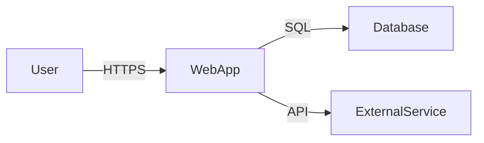

---
agent-notes:
  ctx: "STRIDE + owner-harm (C1-C8) threat model, attack + supply surface inventory"
  deps: []
  state: stub
  last: "claude@2026-07-09"
  key: ["created during Architecture phase", "Pierrot owns, Archie contributes DFDs"]
---
# Threat Model

<!-- Pierrot owns this document. Archie contributes data flow diagrams. -->
<!-- Created during kickoff Phase 3 (Architecture). Updated when the attack surface changes. -->

**Project:** [Project Name] **Last reviewed:** [Date] **Reviewed by:** Pierrot, Archie

## System Overview

<!-- High-level description of what the system does, who uses it, and what data it handles. -->

## Data Flow Diagram

<!-- Mermaid diagram showing data flows, trust boundaries, and external dependencies. -->
<!-- Archie creates the DFD; Pierrot annotates trust boundaries and threat surfaces. -->

## Trust Boundaries

| Boundary | Description | Controls |
|----------|-------------|----------|
| <!-- e.g. Internet → App --> | <!-- User traffic enters the system --> | <!-- TLS, WAF, rate limiting --> |

## Assets

What are we protecting?

| Asset | Classification | Storage | Impact if compromised |
|-------|---------------|---------|----------------------|
| <!-- e.g. User credentials --> | <!-- Confidential --> | <!-- DB, bcrypt hashed --> | <!-- Account takeover --> |

## STRIDE Analysis

For each component/data flow, assess threats across six categories:

### Spoofing (Identity)

| Component | Threat | Likelihood | Impact | Mitigation | Status |
|-----------|--------|------------|--------|------------|--------|
| | | | | | |

### Tampering (Data Integrity)

| Component | Threat | Likelihood | Impact | Mitigation | Status |
|-----------|--------|------------|--------|------------|--------|
| | | | | | |

### Repudiation (Accountability)

| Component | Threat | Likelihood | Impact | Mitigation | Status |
|-----------|--------|------------|--------|------------|--------|
| | | | | | |

### Information Disclosure (Confidentiality)

| Component | Threat | Likelihood | Impact | Mitigation | Status |
|-----------|--------|------------|--------|------------|--------|
| | | | | | |

### Denial of Service (Availability)

| Component | Threat | Likelihood | Impact | Mitigation | Status |
|-----------|--------|------------|--------|------------|--------|
| | | | | | |

### Elevation of Privilege (Authorization)

| Component | Threat | Likelihood | Impact | Mitigation | Status |
|-----------|--------|------------|--------|------------|--------|
| | | | | | |

## Owner-Harm Surface (C1–C8)

STRIDE above models harm to the *system and its users*. This lens models the complementary risk that matters when an AI agent team has real tool access: **harm to you, the owner/operator, caused by your own agents and the tools they run** — whether subverted by a prompt-injection payload, a compromised dependency, or simply an over-eager agent acting beyond its brief. Summon's agents are Claude Code agents with shell access, so C5 and C8 in particular are a live surface here, not a hypothetical.

Assess each category: does the agent/tool setup expose it, and what control bounds it?

| # | Owner-harm category | What it looks like for a coding-agent team | Exposed? | Control |
|---|---------------------|---------------------------------------------|----------|---------|
| C1 | Credential leak | Agent reads `.env`, cloud keys, or tokens and emits them to a log, a commit, or a tool call | | Least-privilege scoped creds; secrets never in agent-readable plaintext; scan diffs for secrets |
| C2 | Infrastructure exposure | Agent opens ports, weakens firewall/IAM, or provisions public resources | | Human approval for infra changes; deny-by-default network posture |
| C3 | Privacy exposure | Agent pulls private/personal data into prompts, logs, or a third-party service | | Data-minimization; no PII in prompts/logs; boundary review |
| C4 | Inner-circle leak | Agent surfaces private repo/org content to an untrusted context or output | | Repo/context isolation; review what leaves the boundary |
| C5 | Asset destruction | Destructive shell (`rm -rf`, `DROP TABLE`, force-push) run against real data | | No destructive ops without human confirm; work on branches/copies; backups |
| C6 | Exfiltration via tools | Agent uses a legitimate tool (curl, git push, an MCP server) as an exfil channel | | Allowlist outbound; review tool grants; treat tool output as untrusted |
| C7 | Hijacking | Injected instructions (from a web page, issue, or dependency) redirect the agent's actions | | No agent message is human consent; untrusted input never authorizes actions |
| C8 | Unauthorized autonomy | Agent takes a large or irreversible action nobody asked for | | Scope every task; irreversible actions need explicit human sign-off |

## Attack Surface Inventory

| Surface | Protocol | Auth required? | Exposed to | Notes |
|---------|----------|---------------|------------|-------|
| <!-- e.g. /api/v1/* --> | <!-- HTTPS --> | <!-- JWT --> | <!-- Internet --> | <!-- Rate limited --> |

**Tool & dependency supply surface.** Beyond network endpoints, an agent team's attack surface includes the code and tools it pulls in: external packages (see the release-age cooldown, ADR-0010), CI actions (pin to commit SHAs — `docs/team-directives.md` § DevOps), and MCP servers (vet, pin, allowlist, watch for rug-pulls — `docs/team-directives.md` § Security). Each is a third party that, if compromised or swapped, can drive the owner-harm categories above.

## Open Risks

Risks that are accepted or not yet mitigated:

| Risk | Severity | Rationale for acceptance | Review date |
|------|----------|------------------------|-------------|
| | | | |
